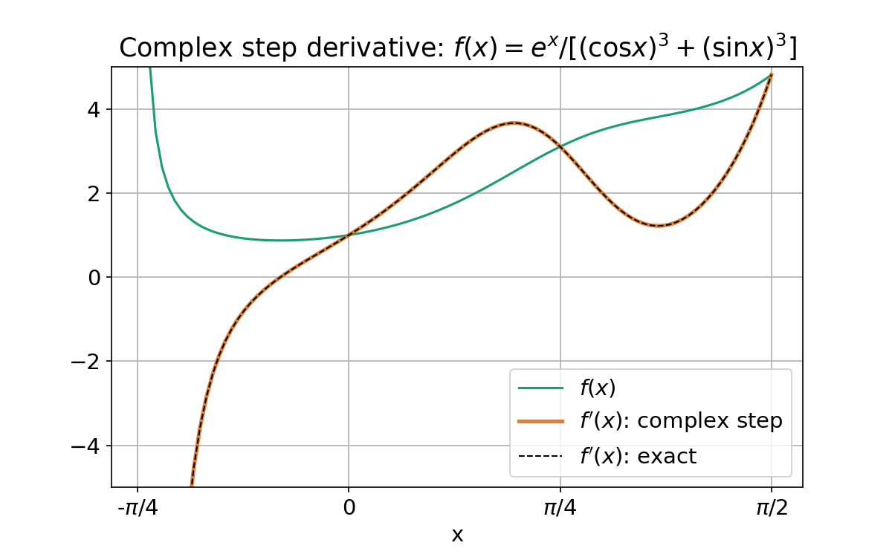
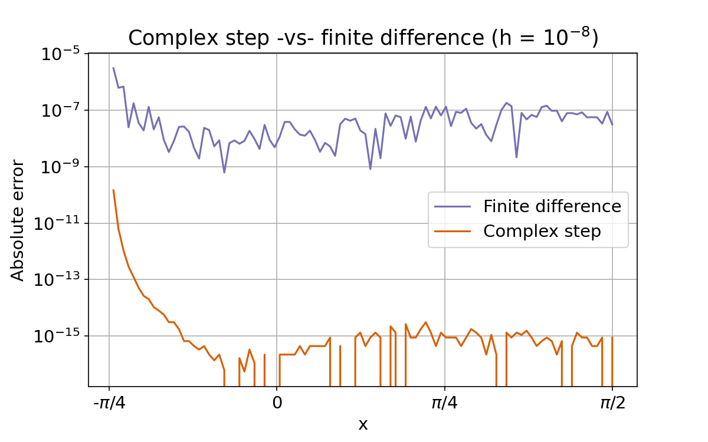
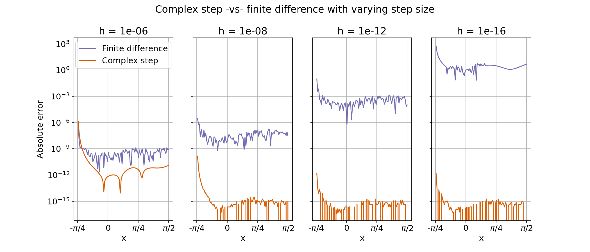

This post explains the complex-step derivative approximation - a formidable-sounding but simple and elegant numerical method to compute the first derivative of a function using complex arithmetic. 

<!--more-->

## Introduction

The complex step derivative approximation is a technique to compute the derivative of a real-valued function $f(x)$. The derivation is a simple two line affair. Expand $f(x)$ in Taylor series using a small imaginary step $i h$ and keep the leading order term in $h$:
$$ \begin{aligned}
f(x + ih) & = f(x) + ih \cdot f'(x) - \frac{h^2}{2!} f''(x) + \ldots \cr
\Re[f(x + ih)] + i \Im[f(x + ih)]  & \approx f(x) + i h \cdot f'(x) 
\end{aligned} $$

Comparing imaginary parts of the two sides gives:
$$\boxed{f'(x) \approx \frac{\Im[f(x + ih)]}{h}} $$

where $h$ is a small step, eg: $10^{-8}$. And that's it! 

## Does it work?

These examples test the formula on some simple functions with known first derivatives 

**Example 1**: $f(x) = x^2$. Expand the right hand side and drop the second order term:
$$ \begin{aligned}
f(x + ih) & = (x + ih) \cdot (x + ih) \cr
& = x^2 + i \cdot(2xh) - \cancel{h^2} 
\end{aligned} $$

Comparing imaginary parts:
$$ f'(x) = \frac{1}{h} \Im[(f(x + ih)] = 2x $$

which is correct.

**Example 2**: $f(x) = \sin(x)$. Expand the right hand side using a trigonometric identity, and use the small number approximations $\sin(\theta) \approx \theta$ and $\cos(\theta) \approx 1$ when $\theta \approx 0$:
$$ \begin{aligned} 
f(x + ih) & = \sin(x + ih) \cr
& = \sin(x) \cos(ih) + \cos(x)  \sin(i h) \cr
& \simeq \sin(x) + ih \cos(x)
\end{aligned} $$

This gives
$$ f'(x) = \frac{1}{h} \Im[f(x + ih)] = \cos(x) $$

which is correct.

**Example 3**: $f(x) = e^x$. Expand the right hand side using Euler's formuela. 
$$ \begin{aligned} 
f(x + ih) & = e^{x + ih} \cr
& = e^x \cdot e^{ih} \cr
& = e^x \left[ \cos(h) + i \sin(h) \right] \cr
& \simeq e^x + i h e^x
\end{aligned} $$

Compare imaginary parts:
$$ f'(x) = \frac{1}{h} \Im[f(x + ih)] = e^x $$

Right again!

## Does it *really* work? 

The next example implements this method in Python to numerically compute the derivative of
$$ f(x) = \frac{e^x}{(\cos x)^3 + (\sin x)^3} $$

This function is a standard example used to demonstrate the complex step derivative. The plot below shows the function (green curve) and its derivative computed using the complex step approximation (orange curve) overlaid with the *exact* analytic solution (dashed curve). Visually, the approximation is indistinguishable from the exact solution. A more rigorous error analysis is described in the next section



### Code & explanation

To generate this plot first define a function that implements the complex step derivative for any input function. 
```python
import numpy as np
def csderiv(func, h = 1e-8):
    # Complex-step derivative approximation
    return( lambda x: np.imag(func(np.complex(x, h)))/h )
```

Then define the specific function above and its complex step derivative
```python
f = lambda x: np.exp(x) / ((np.cos(x))**3 + (np.sin(x))**3)
dfdx = csderiv(f)
```

For comparison, define the exact analytical derivative
$$ f'(x) = f(x) \cdot \frac{(\cos x)^3 + (\sin x)^3 + 3 \cos x \sin x \left(\cos x - \sin x \right)}{(\cos x)^3 + (\sin x)^3}
$$

```python
def fprime(x): 
    # Analytic derivative of e^x / ((cos x)^3 + (sin x)^3)
    den = (np.cos(x))**3 + (np.sin(x))**3
    num = np.exp(x) * (den + 3*np.cos(x)*np.sin(x)*(np.cos(x) - np.sin(x)))
    return( num/(den*den) )
```

To generate data for the plot, compute the function its derivative using both methods over a range
```python
x = np.linspace(-3.9*np.pi/16, np.pi/2, 100)
y, dy, exact = [np.array([y(xval) for xval in x]) for y in (f, dfdx, fprime)]
```

Finally, plot results
```python
# Plot function and derivative
import matplotlib.pyplot as plt
import matplotlib as mpl

fig, ax = plt.subplots()
ax.plot(x, y, lw = 1.5, label = "$f(x)$")
ax.plot(x, dy, lw = 2.5, alpha = 0.8, label = "$f'(x)$: complex step")
ax.plot(x, exact, "k--", lw = 1, label = "$f'(x)$: exact")
ax.legend()
ax.set_ylim([-5, 5])
ax.set_xticks([-np.pi/4, 0, np.pi/4, np.pi/2])
ax.set_xticklabels(("-$\pi$/4", "0", "$\pi$/4", "$\pi$/2"))
ax.grid(True)
```

## How good is it? 

To evaluate the accuracy of this approximation we can compute the absolute error between the complex step derivative and the exact solution. For comparison the derivative is also calculated using the finite difference approximation:
$$f'_{\text{fd}}(x) \simeq \frac{f(x + h/2) - f(x - h/2)}{h} $$

Results are shown below:


The complex step approximation is more accurate than the finite difference estimate by several orders of magnitude. The next set of plots examines the effect of changing the step size $h$ on the accuracy of the two methods. 


The complex step derivative approximation continues to be accurate with smaller step sizes whereas the finite difference estimate gets worse. This seemingly non-intuitive behavior of the finite difference approximation is the result of truncation error from the subtraction of two numbers that are close to each other. As $h$ gets smaller the two terms in the numerator get closer to each other and leading digits in the difference $f(x + h/2) - f(x - h/2)$ become 0. The complex step approximation is not subject to this truncation error.

The following code computes the finite difference approximation and plots the absolute error for each estimate. 
```python
def fdiff(func, h = 1e-8):
    # Finite difference derivative approximation
    return( lambda x: (f(x+h/2) - f(x-h/2))/h )

# Compute finite difference 
dfdx_fd = fdiff(f)
dy_fd = np.array([dfdx_fd(xval) for xval in x])

# Plot absolute error
fig, ax = plt.subplots()
ax.plot(x, np.abs(dy_fd - exact), "C2", lw = 1.5,
        label = "Finite difference")
ax.plot(x, np.abs(dy - exact), "C1", lw = 1.5, 
        label = "Complex step")
ax.set_yscale("log")
ax.legend()
ax.set_ylabel("Absolute error")
ax.set_xticks([-np.pi/4, 0, np.pi/4, np.pi/2])
ax.set_xticklabels(("-$\pi$/4", "0", "$\pi$/4", "$\pi$/2"))
ax.set_title(r"Complex step -vs- finite difference (h = $10^{-8}$)")
ax.set_xlabel("x")
ax.grid(True)
```

The next block computes the derivative using both methods with different step sizes to generate the final panel of plots.
```python
# Compute both approximations for different step sizes
steps = [1e-6, 1e-8, 1e-12, 1e-16]
csout = {h: np.array([csderiv(f, h)(xvals) for xvals in x]) 
         for h in steps}
fdout = {h: np.array([fdiff(f, h)(xvals) for xvals in x]) 
         for h in steps}

# Plot absolute errors for each step size
fig, splots = plt.subplots(ncols = 4, sharey = "row")
for jj, h in enumerate(steps):
    y1, y2 = csout[h], fdout[h]
    ax = splots[jj]
    ax.plot(x, abs(y2 - exact), "C2", lw = 1.5,
            label = "Finite difference")
    ax.plot(x, abs(y1 - exact), "C1", lw = 1.5,
            label = "Complex step")
    ax.set_yscale("log")
    ax.set_xticks([-np.pi/4, 0, np.pi/4, np.pi/2])
    ax.set_xticklabels(("-$\pi$/4", "0", "$\pi$/4", "$\pi$/2"))
    ax.set_xlabel("x")
    ax.set_title(f"h = {h:.0e}")
    ax.grid()
    if jj == 0:
        ax.set_ylabel("Absolute error")
        ax.legend(loc = "upper right", 
                  bbox_to_anchor = (1.02, 1))
plt.suptitle("Complex step -vs- finite difference with varying step size")
```

## Notes and References

The complex step derivative approximation was first described by Squire & Trapp (1998) based on results originally presented by Lyness & Moler (1967). Complete code for this example is available in [this Jupyter notebook](https://github.com/dododas/dododas.github.io/blob/main/content/posts//2021-03-28-complex-step-derivative/complex-step-derivative.ipynb)

**References**

1. "Using Complex Variables to Estimate Derivatives of Real Functions" by Squire and Trapp, *SIAM Rev.*, 40(1), 110–112 https://epubs.siam.org/doi/abs/10.1137/S003614459631241X
2. "Numerical differentiation of analytic functions" by Lyness and Moler, *SIAM J Numer Anal*, 4(2), 202-210 https://epubs.siam.org/doi/abs/10.1137/0704019
3. https://blogs.mathworks.com/cleve/2013/10/14/complex-step-differentiation
4. [Download Jupyter notebook with code](complex-step-derivative.ipynb)

