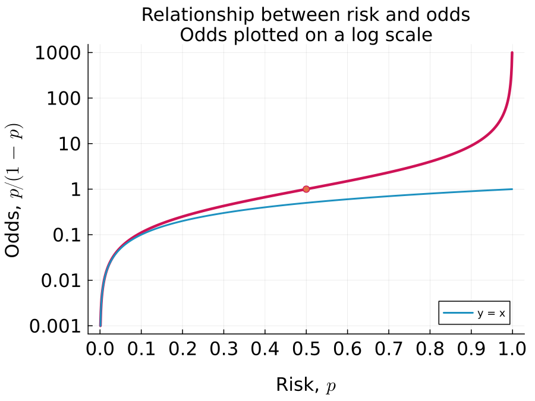
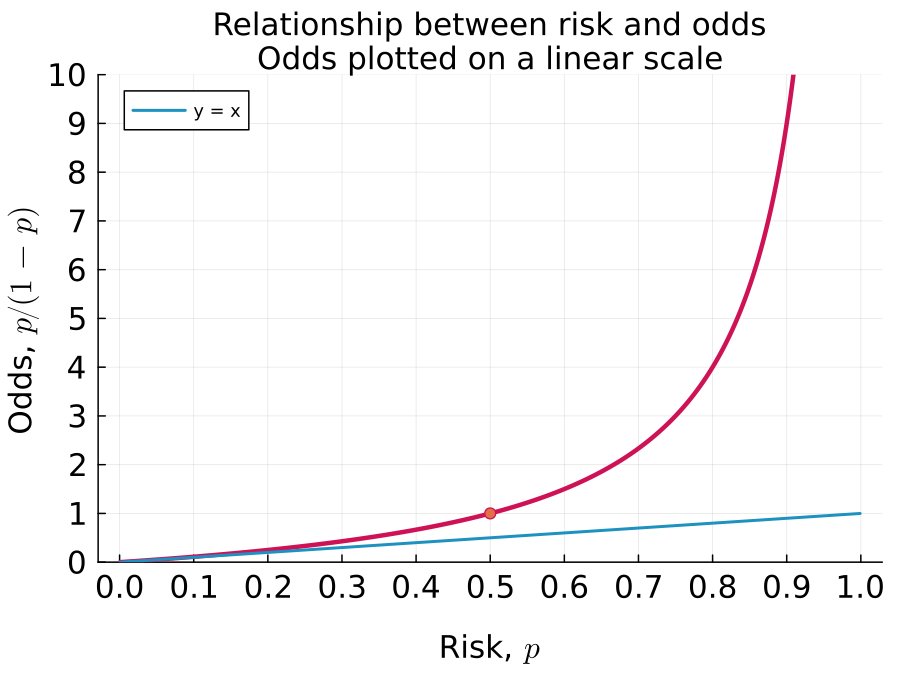
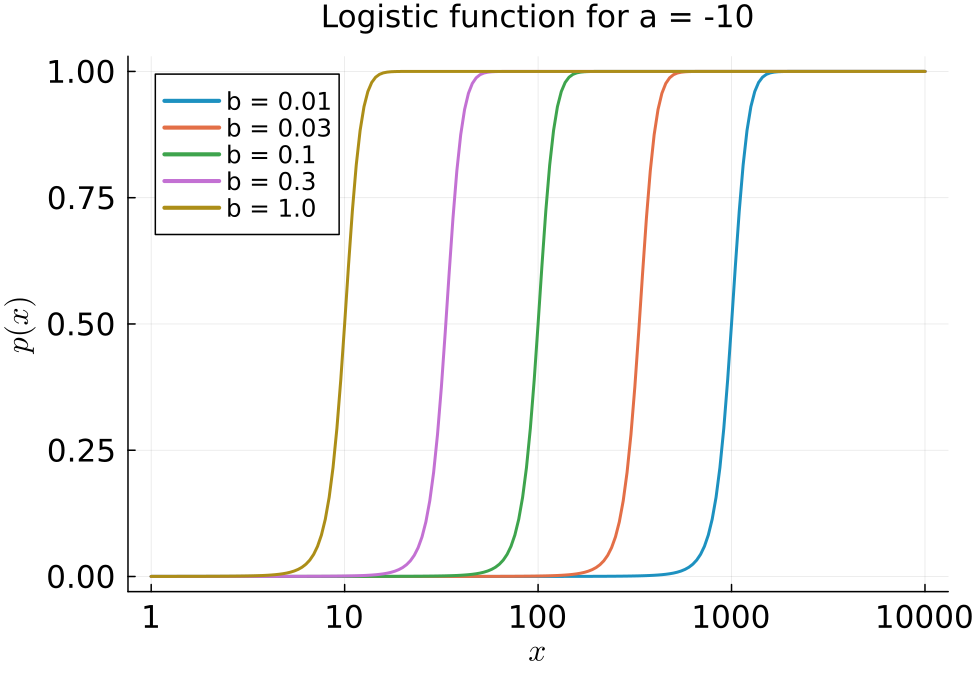

This post uses some simple plots to explain the concept of odds and how it is related to risk, or the probability of an event.

<!--more-->

## Odds versus risk

Risk and odds are two alternate ways of representing the probability of an event. The **risk** of an event, such as, winning the toss of a fair coin, or getting diagnosed with cancer in one's lifetime is another name for the probability of that event. The **odds** of an event with probability $p$ is the risk of that event relative to the risk of it not happening:
$$ {\text{odds }} = \frac{p}{1 - p} = \frac{\text{risk}}{1 - \text{risk}} $$

The inverse relationship is:
$$ \text{risk } = p = \frac{\text{odds}}{1 + \text{odds}} $$

This plot shows the relationship between odds and risk (red curve)



The table on the right lists odds for some select probabilities. It is typical to write odds as a fraction, such as 1:10.  

The plot above highlights two key points:  
1. Odds and risk are nearly equal to each other for events with a low probability, i.e. when $p \approx 0$. Visually, this is where the red odds -vs- risk curve overlaps with the blue $y = x$ curve.  

<--->

Risk, $p$  | Odds, $p/(1 - p)$ | Description 
---- | :--: | ---
0.009 | 1/100 = 0.01 | 100:1 against
0.09  | 1/10  = 0.1  | 10:1 against
0.5   | 1/1   = 1    | Equal odds
0.91  | 10/1  = 10   | 10:1 for
0.991 | 100/1 = 100  | 100:1 for



2. When plotted on a log scale, the odds curve has a symmetric shape about $p = 0.5$. This symmetric shape arises because replacing $p$ with $1-p$ is equivalent to switching the numerator and denominator in the definition of odds. For example, the odds flip from from 10:1 to 1:10 if the risk changes from 0.09 to 1 - 0.09 = 0.91. This behavior is not obvious with odds plotted on a linear scale as seen below:

## Application of odds

There are two common applications of odds in analyzing biological data:  
1. To estimate an odds ratio to determine the strength of association between two binary variables - for example, smoking and getting lung cancer.  
2. As the response variable in logistic regression which relates a continuous variable, such as the dose of a drug, on a binary response variable, such as disease-free survival. The relationship is modeled as:  
$$ \log(\text{odds }) = a + b \cdot \text{dose } $$
Using the relationship between odds and probability, this can be transformed to:  
$$\begin{aligned}
\frac{p}{1 - p} & = \exp\left(a + b \cdot \text{dose }\right) \\\
p & = \frac{ \exp\left(a + b \cdot \text{dose }\right) }{1 +  \exp\left(a + b \cdot \text{dose }\right) } \\\
& = \frac{1}{1 +  \exp\left[ -\left(a + b \cdot \text{dose } \right) \right] }
\end{aligned}$$
which is the logistic function. The figure below shows plots of the logistic function for a fixed $a$ and different values of $b$. The EC$_{50}$ of the response is at $x = -a/b$, which shifts to the left as $b$ increases.

## Summary

Odds are an alternate way of representing the probability or risk of an event. For low probability events ($p \approx 0$), odds is approximately the same as the probability $p/(1 - p) \approx p$. But while probability can only range between 0 and 1, odds can take on any value between 0 and $\infty$. Log odds can therefore range between $-\infty$ and $\infty$. This makes it convenient to relate log odds for a binary event, such as responding to a drug or not, to a continuous variable, such as dose. This idea lies behind a logistic regression model. 

